# 🌍 Teer Enta - Your Personal Travel Companion

<div align="center">
  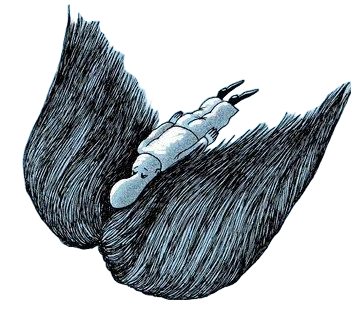
</div>

---

### 🚀 Revolutionizing Travel Planning

Teer Enta brings together personalized recommendations, seamless booking, and smart budgeting into one intuitive platform. Built with the **MERN stack**, it's your ultimate companion for crafting unforgettable travel experiences.

---

## ✨ Overview

Teer Enta combines technology and travel to simplify your planning process. From smart itinerary suggestions to budget tracking and real-time updates, Teer Enta ensures you focus on the journey, not the logistics.  

**Current Version:** `1.0.0`  
**Development Stage:** **Beta**

---

## 🎯 Motivation

*Why Teer Enta?*  
Travel planning can often feel overwhelming, with countless websites and tools required to organize a single trip. From researching destinations to booking accommodations and managing budgets, travelers frequently find themselves juggling multiple platforms.
We created Teer Enta to simplify and streamline the travel experience. Our goal is to provide:
- A single platform for planning, booking, and managing trips.
- An intuitive interface for tourists, sellers, and tour guides.
- Features that empower users to discover unique experiences and make informed decisions.
By combining personalization, seamless transactions, and comprehensive planning tools, this app ensures stress-free travel, enabling users to focus on creating memories rather than logistics.

## 🧱 Build Status

The current build status reflects whether the project is successfully building and passing all tests:

- **✅ Passing**: The latest on commit main branch is stable and free of errors.

---

## 🎨 Code Styles
This section outlines the coding standards and best practices followed in the development of this **MERN** stack project to maintain clean, readable, and maintainable code. 

---

### 1. 🖥️ **JavaScript and Node.js Code Style (Backend)**
- **ESLint**:  ESLint is configured to enforce consistent coding styles, catch potential errors, and improve overall code quality.
- **Prettier**:  Prettier is integrated to automatically format code according to a uniform style, ensuring consistency across the project.
- **Modularization**:  The backend code is broken into modular components such as controllers, models, routes, and middlewares to enhance reusability and maintainability.
- **Naming Conventions**: 
  - Variables and functions use **camelCase** .
  - Classes use **PascalCase** .
- **Error Handling**:  Custom error classes and middleware are used to handle errors consistently and provide meaningful API responses.

---

### 2. ⚛️ **React Code Style (Frontend)**
- **Component Organization**: 
  -  Functional components with hooks are used over class components for cleaner, more modern React code.
  -  Components are organized in feature-based directories for better maintainability.
- **JSX Formatting**: 
  -  Proper indentation is maintained in JSX.
  -  Self-closing tags are used when applicable.
- **State Management**: 
  -  Redux/React Context (if applicable) is used for state management, following the principles of unidirectional data flow.
- **Styling**: 
  -  Styling is handled via Tailwind-Css for modular and maintainable styles.
- **Prop Types / TypeScript**: 
  -  **PropTypes** or **TypeScript** are used to provide type safety for props and state, ensuring better code reliability.

---

### 3. 🗃️ **MongoDB & Mongoose Code Style**
- **Schema Design**: 
  -  MongoDB schemas are designed using Mongoose, following consistent naming conventions for model names and fields.
  -  Validation and default values are implemented where appropriate.
- **Query Optimization**: 
  -  Queries are optimized to avoid performance bottlenecks, such as using indexes and limiting the number of records returned.
- **Population and Referencing**: 
  -  Efficient use of Mongoose’s `populate()` to handle relationships between models and avoid unnecessary queries.
---

## 🛠️ Tech Stack

### Frontend
- ⚛️ **React.js**
- 🔄 **Redux**
- 🎨 **Ant-Design** / **Tailwind CSS**
- 🧭 **React Router**

### Backend
- 📦 **Node.js**
- 🚂 **Express.js**
- 🍃 **MongoDB**
- 🔍 **Mongoose**

### Tools & Deployment
- 📊 **Git** & **GitHub**
- 🚀 Deployment on [Your Platform]
- 🔐 **JWT Authentication**
- 📡**Cloudinary**
- **Firebase** 

---

## 📜 Code Examples

In this section, we provide examples of key parts of the codebase to demonstrate the functionality and practices implemented throughout the MERN stack project.

### 1. 🌐 **Express Server Setup (Backend)**
Here’s an example of how we set up our Express server with basic configurations and routes.

## 📜 Code Examples

### 1. 🌐 **Express Server Setup** (Backend)
In this section, we provide a simplified version of how the server is set up and connected to the database.

```javascript
const express = require("express");
const mongoose = require("mongoose");
const morgan = require("morgan");
const cors = require("cors");
const app = express();
const dbUrl = process.env.DB_URL;
const PORT = process.env.PORT || 8000;

// Middleware setup
app.use(morgan('dev'));
app.use(cors());
app.use(express.json());

// Connect to MongoDB
mongoose.connect(dbUrl).then(() => {
  console.log('Connected to DB');
}).catch((error) => {
  console.error('Could not connect to DB.', error);
});
```

### 2.🧩 Route Setup Example (Backend)
This example demonstrates how routes are set up for handling requests in the application.
```javascript
const activityRoutes = require('./routes/activity');
const itineraryRoutes = require('./routes/Itinerary');

// Using the routes
app.use("/activity", activityRoutes);
app.use("/itinerary", itineraryRoutes);
```

### 3.🔄 Socket Initialization (Backend)
We are using http and a custom socket initialization for real-time features.
```javascript
const http = require('http');
const { initSocket } = require("./Util/socket");

const server = http.createServer(app);
initSocket(server);

// Start server
server.listen(PORT, () => {
  console.log(`Server is running on port ${PORT}`);
});
```

### 4.⚠️ 404 Error Handling (Backend)
Handling undefined routes with a simple 404 error response.
```javascript
app.use((req, res) => {
  res.status(404).json({ message: "This page doesn't exist" });
});
```

### 5.🔒 JWT Authentication Middleware (Backend)
```javascript
const jwt = require("jsonwebtoken");
const Token = require("../models/Users/Token");
const errorHandler = require("../Util/ErrorHandler/errorSender");

module.exports = async (req, res, next) => {
    const authHeader = req.headers["authorization"];
    if (!authHeader) {
        return res.status(401).json({ message: "Not Authenticated" });
    }
    const token = authHeader.split(" ")[1];
    let decodedToken;

    try {
        decodedToken = jwt.verify(token, process.env.JWT_SECRET_ACCESS);
        if (!decodedToken) {
            return res.status(401).json({ message: "Token is Not Correct" });
        }

        const checkToken = await Token.findOne({ token: token });
        if (!checkToken) {
            return res.status(403).json({ message: "Login first" });
        }

        if (checkToken.blackListedToken) {
            return res.status(403).json({
                message: "You are blocked, You cannot perform this request",
            });
        }

        req.user = {
            _id: decodedToken.userId,
            hasProfile: decodedToken.hasProfile,
            role: decodedToken.userRole ,
            accessToken: token
        };
        req.body.createdBy = req.user._id ;
        next();

    } catch (err) {
        errorHandler.SendError(res, err);
    }
};
```

### 6.🗃️ Mongoose Schema (Backend)

```javascript
const mongoose = require('mongoose');

const ActivitySchema = new mongoose.Schema({
    name: {type: String, required: true},
    date: {type: Date, required: true},
    time: {type: String, required: true},
    imageUrl: {type: String},
    isBookingOpen: {type: Boolean, default: true},
    location: {
        lat: {type: Number, required: true},
        lng: {type: Number, required: true}
    },
    isActive: {type: Boolean, default: true},
    isAppropriate :{type:Boolean , default:true} ,
    price: {
        min: Number,
        max: Number
    },
    category: {type: mongoose.Schema.Types.ObjectId, ref: 'ActivityCategory'},
    preferenceTags: [{type: mongoose.Schema.Types.ObjectId, ref: 'PreferenceTags'}],
    specialDiscounts: [
        {
            discount: Number,
            Description: String,
            isAvailable: {type: Boolean, default: false}
        }
    ],
    ratings: [{
        user: {type: mongoose.Schema.Types.ObjectId, ref: 'User'},
        rating: Number ,
        createdAt: {type: Date, default: Date.now}
    }],
    comments: [{
        user: {type: mongoose.Schema.Types.ObjectId, ref: 'User'},
        comment: String,
        createdAt: {type: Date, default: Date.now}
    }],
    createdBy: {type: mongoose.Schema.Types.ObjectId, ref: 'User'},

}, {timestamps: true});

module.exports = mongoose.model('Activity', ActivitySchema);
```

### 7.⚛️ React Component example (frontend)
  PreferenceTags Component Examples
    This document breaks down the PreferenceTags component into reusable code sections. Each example demonstrates a specific functionality of the component.
    Table of Contents
      # Project Documentation

| **Section**         | **Description**                                                                                                                                           |
|---------------------|-----------------------------------------------------------------------------------------------------------------------------------------------------------|
| **Basic Setup**      | Initial setup of the project, including environment configuration, necessary dependencies, and project structure.                                          |
| **State Management** | Management of global state for the application using a state management library (e.g., Redux).                                                            |
| **API Integration**  | Integrating APIs to fetch or send data to backend services using RESTful API calls.                                                                       |
| **Table Configuration** | Configuration of tables to display data in a structured format, including sorting and filtering options.                                                |
| **Modal Form**       | Allows users to submit data via a form within a popup/modal window.                                                                                      |
| **Component Layout** | Structure and layout of components, ensuring modularity and responsiveness using grid systems or flexbox.                                                |

### Basic setup

```javascript
    import React, { useState, useEffect } from "react";
    import {
        Table, Button, Modal, Form, Input, Switch,
        ConfigProvider, Tooltip, message
    } from "antd";
    import {
        PlusOutlined, DeleteOutlined, ExclamationCircleOutlined,
        EditOutlined, TagsOutlined, CheckCircleOutlined
    } from "@ant-design/icons";
    
    const { Item } = Form;
    
    const PreferenceTags = ({ setFlag }) => {
        // Component implementation
    };
    
    export default PreferenceTags;
```

### State Management

```javascript
  // State hooks for managing component data and UI
  const [tags, setTags] = useState([]);
  const [loading, setLoading] = useState(true);
  const [submitting, setSubmitting] = useState(false);
  const [modalVisible, setModalVisible] = useState(false);
  const [isEditing, setIsEditing] = useState(false);
  const [currentTag, setCurrentTag] = useState(null);
  const [form] = Form.useForm();
  
  useEffect(() => {
      setFlag(false);
      fetchTags();
  }, [setFlag]);
```

### API Integration

```javascript
  // API interaction methods
  const fetchTags = async () => {
      setLoading(true);
      try {
          const response = await getPreferenceTags();
          setTags(response.data);
      } catch (error) {
          message.warning(error.response.data.message);
      } finally {
          setLoading(false);
      }
  };
  
  const handleSubmit = async (values) => {
      setSubmitting(true);
      try {
          if (isEditing) {
              await updatePreferenceTag({ ...currentTag, ...values });
              message.success("Tag updated successfully");
          } else {
              await createPreferenceTag(values);
              message.success("Tag created successfully");
          }
          fetchTags();
          setModalVisible(false);
          form.resetFields();
      } catch (error) {
          message.warning(error.response.data.message);
      } finally {
          setSubmitting(false);
      }
  };
  
  const handleDelete = async (id) => {
      try {
          await deletePreferenceTag(id);
          message.success("Preference Tag deleted successfully")
          fetchTags();
      } catch (error) {
          message.warning(error.response.data.message);
      }
  };
```

### Table configurations

```javascript
  const columns = [
      {
          title: "Tag Name",
          dataIndex: "tag",
          key: "tag",
          render: (text) => (
              <div className="flex items-center">
                  <TagsOutlined className="mr-2 text-[#1C325B]" />
                  <span className="font-medium">{text}</span>
              </div>
          ),
      },
      {
          title: "Status",
          dataIndex: "isActive",
          key: "isActive",
          render: (isActive) => (
              <div className="flex items-center">
                  <CheckCircleOutlined
                      className={`mr-2 ${
                          isActive ? "text-emerald-500" : "text-gray-400"
                      }`}
                  />
                  <span
                      className={
                          isActive ? "text-emerald-600 font-medium" : "text-gray-500"
                      }
                  >
                      {isActive ? "Active" : "Inactive"}
                  </span>
              </div>
          ),
      },
      {
          title: "Actions",
          key: "actions",
          render: (_, record) => (
              // Actions column implementation
          ),
      },
  ];
```

### Modal form 

```javascript
  <Modal
      title={
          <div className="text-lg font-semibold text-[#1C325B]">
              {isEditing ? "Edit Tag" : "Create New Tag"}
          </div>
      }
      open={modalVisible}
      onCancel={() => {
          setModalVisible(false);
          form.resetFields();
      }}
      footer={null}
      className="top-8"
  >
      <Form
          form={form}
          layout="vertical"
          onFinish={handleSubmit}
          className="mt-4"
      >
          <Item
              label={<span className="text-gray-700 font-medium">Tag Name</span>}
              name="tag"
              rules={[{ required: true, message: "Please enter tag name" }]}
          >
              <Input
                  prefix={<TagsOutlined className="text-gray-400" />}
                  placeholder="Enter tag name"
                  className="h-10"
              />
          </Item>
  
          <Item
              label={<span className="text-gray-700 font-medium">Status</span>}
              name="isActive"
              valuePropName="checked"
              initialValue={true}
          >
              <Switch />
          </Item>
  
          <div className="flex justify-end space-x-2 mt-6">
              <Button
                  onClick={() => {
                      setModalVisible(false);
                      form.resetFields();
                  }}
                  disabled={submitting}
                  className="hover:bg-gray-50"
              >
                  Cancel
              </Button>
              <Button
                  type="primary"
                  htmlType="submit"
                  loading={submitting}
                  className="bg-[#1C325B] hover:bg-[#1C325B]/90"
              >
                  {isEditing ? "Update" : "Create"} Tag
              </Button>
          </div>
      </Form>
  </Modal>
```

### Component Layout

```javascript
  return (
      <ConfigProvider
          theme={{
              token: {
                  colorPrimary: "#1C325B",
              },
          }}
      >
          <div className="flex justify-center">
              <div className="p-6 w-[90%]">
                  <div className="max-w-7xl mx-auto">
                      <div className="bg-white rounded-2xl shadow-xl p-8 border border-gray-100">
                          {/* Header Section */}
                          <div className="px-6 py-4 border-b border-gray-200">
                              {/* Header content */}
                          </div>
  
                          {/* Table Section */}
                          <div className="p-6">
                              <Table
                                  columns={columns}
                                  dataSource={tags}
                                  rowKey="_id"
                                  loading={loading}
                                  pagination={{
                                      pageSize: 10,
                                      showTotal: (total) => `Total ${total} tags`,
                                  }}
                                  className="border border-gray-200 rounded-lg"
                                  rowClassName="hover:bg-[#1C325B]/5"
                              />
                          </div>
                      </div>
                  </div>
              </div>
          </div>
      </ConfigProvider>
  );
```

### Usage

```javascript
// Import the component
import PreferenceTags from './components/PreferenceTags';

// Use in your application
function App() {
    const handleFlagChange = (flag) => {
        // Handle flag change
    };

    return (
        <PreferenceTags setFlag={handleFlagChange} />
    );
}
```

---
# 🌍 Welcome to Our Tourism Platform!

Your ultimate tourism and e-commerce platform connecting tourists with guides, activities, and local treasures!

## 👤 User Account Features

### Authentication & Security
- 🔐 Login with username and password
- 🔄 Password change functionality
- 📧 Password recovery via email OTP
- 🗑️ Account deletion options

### Registration Options
#### 🎒 Tourist Registration:
- Email, username, password
- Mobile number
- Nationality
- Date of birth
- Job/student status

#### 🧭 Service Provider Registration (Tour Guides/Advertisers/Sellers):
- Basic info: Username, email, password
- 📄 Document upload for verification
- ✅ Terms and conditions acceptance
- 👥 Profile customization options:
  - Tour Guides: Experience, previous work, mobile
  - Advertisers: Website link, hotline, company profile
  - Sellers: Business name and description

## 👨‍💼 Administrative Features

### 🎫 User Management
- 👑 Add Tourism Governors
- 👤 Add new administrators
- ✅ Review and verify provider documents
- ✍️ Accept/reject service providers
- 📊 View user statistics and growth

### 📝 Content Management
- 🏷️ Create/manage activity categories
- 🎯 Create/manage preference tags
- 🚩 Flag inappropriate content
- 💼 Handle complaints and reports

## 🎯 Activity & Tour Management

### 🎨 Activity Features
- 📅 Create/edit activities with:
  - Date and time
  - Location (Google Maps integration)
  - Price/price range
  - Category and tags
  - Special discounts
  - Booking availability

### 🗺️ Itinerary Management
- ✏️ Create/edit itineraries including:
  - Activities list
  - Location details
  - Timeline
  - Activity durations
  - Tour language
  - Pricing
  - Available dates/times
  - Accessibility options
  - Pick-up/drop-off points

### 🏛️ Historical Places & Museums
- 📝 Create/edit location details
- 🖼️ Add pictures
- 📍 Set location
- ⏰ Specify opening hours
- 💰 List ticket prices
- 🏷️ Add historical period tags

## 💼 Business Tools

### 📊 Reporting
- 💰 View sales reports by:
  - Activities
  - Itineraries
  - Gift shop sales
  - Date/month filters
- 👥 Tourist engagement metrics
- 📈 Revenue analytics

### 📧 Notifications
- 🚩 Inappropriate content flags
- 📬 Email notifications
- 📱 System notifications

## 🎒 Tourist Features

### 🗺️ Trip Planning
- 📝 Step-by-step vacation guide
- ✅ Set travel preferences:
  - Historical areas
  - Beaches
  - Family-friendly activities
  - Shopping
  - Budget requirements
- 🔍 Search functionality:
  - By name
  - By category
  - By tags

### 🎫 Booking & Reservations
- ✈️ Flight booking (3rd party integration)
- 🏨 Hotel booking (3rd party integration)
- 🚗 Transportation booking
- 🎯 Activity/tour booking
- 💳 Multiple payment options:
  - Credit/debit cards (Stripe)
  - Digital wallet
- ❌ 48-hour cancellation policy

### 💰 Financial Features
- 👛 Digital wallet management
- 📧 Payment receipts via email
- 💰 Refund tracking
- 🎁 Loyalty points system
- 🏅 Achievement badges
- 💱 Multi-currency support

### 📱 User Experience
- ⭐ Rate and review:
  - Tour guides
  - Itineraries
  - Activities
  - Products
- 🔖 Bookmark favorite events
- 🔔 Booking notifications
- 📧 Email reminders
- 📱 Mobile notifications

## 🛍️ Shopping Features

### Product Management
- 📝 View all products with:
  - Pictures
  - Prices
  - Descriptions
  - Seller info
  - Ratings/reviews
- 🔍 Search and filter options
- 📊 Stock management

### Shopping Experience
- 🛒 Shopping cart functionality
- 💝 Wishlist management
- 📦 Multiple delivery addresses
- 💳 Payment options:
  - Wallet
  - Credit card (Stripe)
  - Cash on delivery
- 📦 Order tracking
- ❌ Order cancellation

### 🎁 Special Features
- 🏷️ Promo code creation/usage
- 🎂 Birthday promotions
- 📨 Out-of-stock notifications
- 💰 Wallet balance tracking

## 📝 Support System

### Complaint Management
- ✏️ File complaints with:
  - Title
  - Description
  - Date
- 👀 Track complaint status
- 💬 Receive admin responses
- 🔍 Filter complaints by status
- 📅 Sort by date

## 🔒 Security & Privacy
- 🔐 Secure authentication
- 🛡️ Protected payments
- 🔒 Data privacy
- ✅ Service provider verification

## 🌐 Platform Features
- 🔄 Real-time updates
- 📱 Mobile responsiveness
- 🌍 Multi-language support
- 📊 Performance analytics
- 📧 Automated notifications
- 💱 Currency conversion

Need any help getting started? Contact our support team! 🤝

Join us today and start planning your next amazing adventure! 🌟


## 📸 Screenshots

<table>
<tr>
    <td align="center" width="33%">
        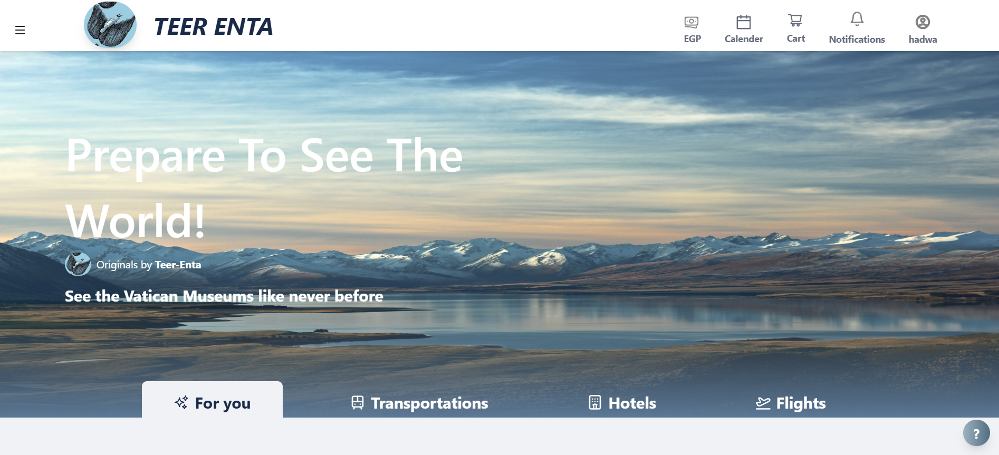
        <p><b>🏠 Homepage</b></p>
    </td>
    <td align="center" width="33%">
        
        <p><b>🏛️ Historical Places</b></p>
    </td>
    <td align="center" width="33%">
        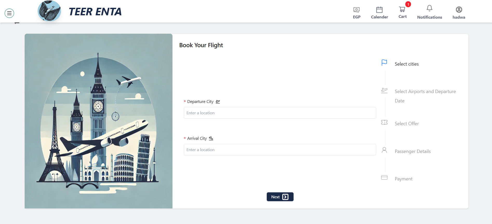
        <p><b>✈️ Flight Booking</b></p>
    </td>
</tr>
<tr>
    <td align="center" width="33%">
        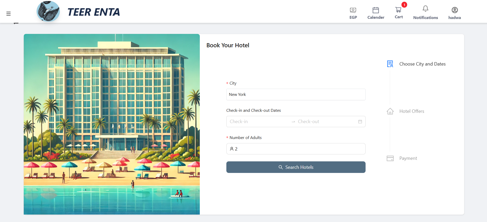
        <p><b>🏨 Hotel Booking</b></p>
    </td>
    <td align="center" width="33%">
        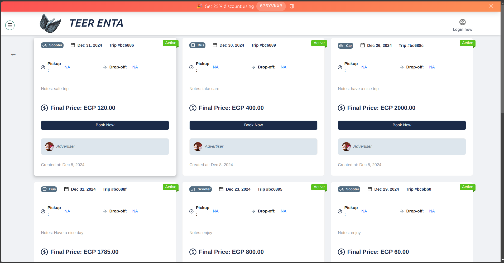
        <p><b>🚌 Transportation</b></p>
    </td>
    <td align="center" width="33%">
        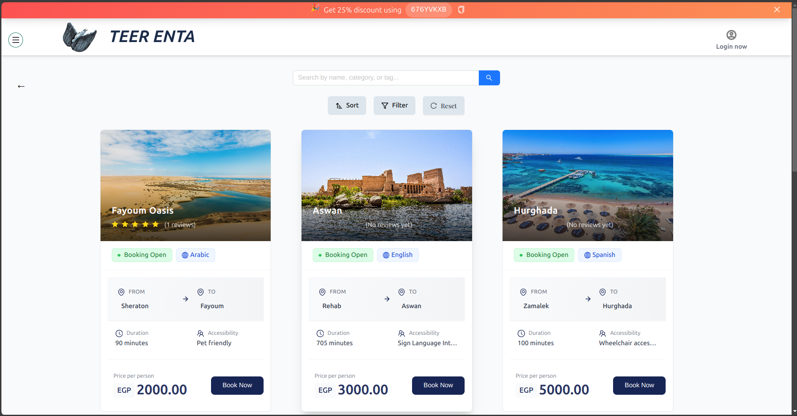
        <p><b>🗺️ Itineraries</b></p>
    </td>
</tr>
<tr>
    <td align="center" width="33%">
        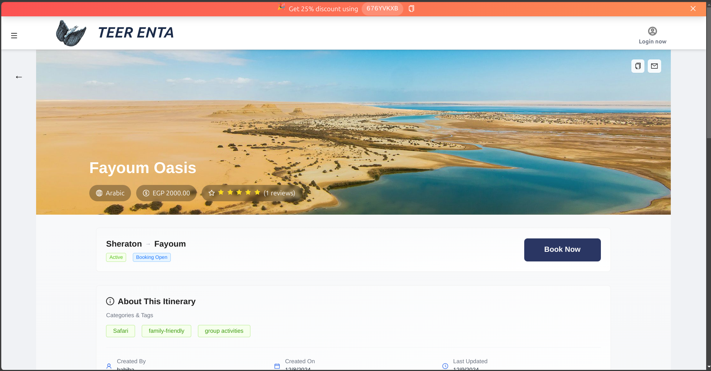
        <p><b>📋 Itinerary Details</b></p>
    </td>
    <td align="center" width="33%">
        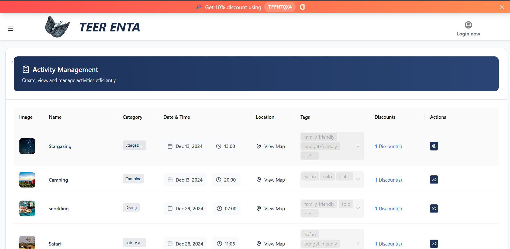
        <p><b>🎯 Activities</b></p>
    </td>
    <td align="center" width="33%">
        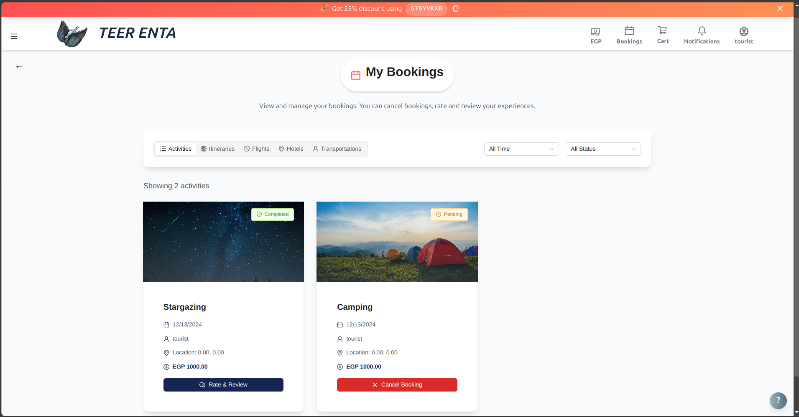
        <p><b>🎫 Bookings</b></p>
    </td>
</tr>
<tr>
    <td align="center" width="33%">
        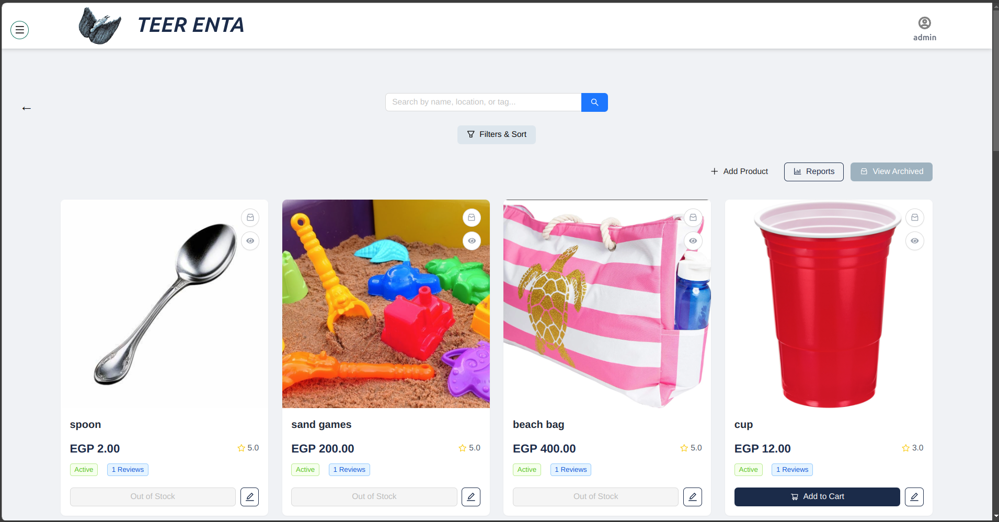
        <p><b>🛍️ Products List</b></p>
    </td>
    <td align="center" width="33%">
        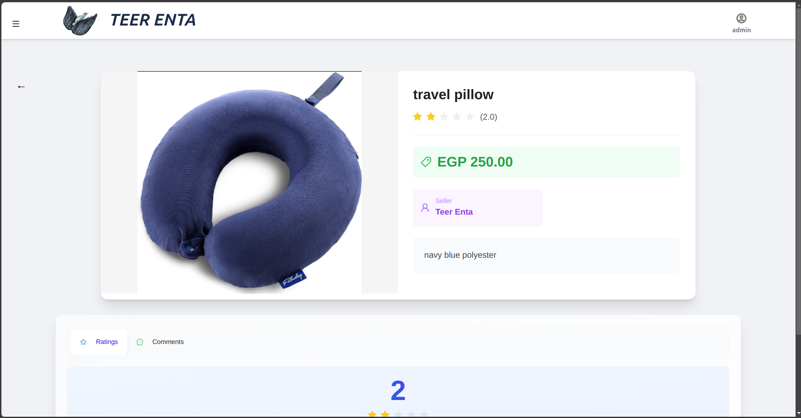
        <p><b>📦 Product Details</b></p>
    </td>
    <td align="center" width="33%">
        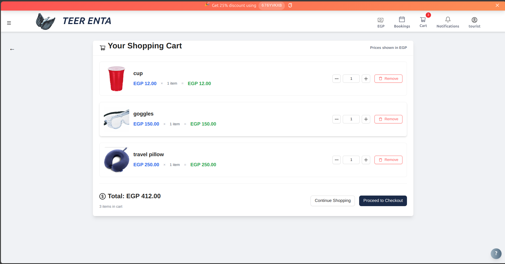
        <p><b>🛒 Shopping Cart</b></p>
    </td>
</tr>
<tr>
    <td align="center" width="33%">
        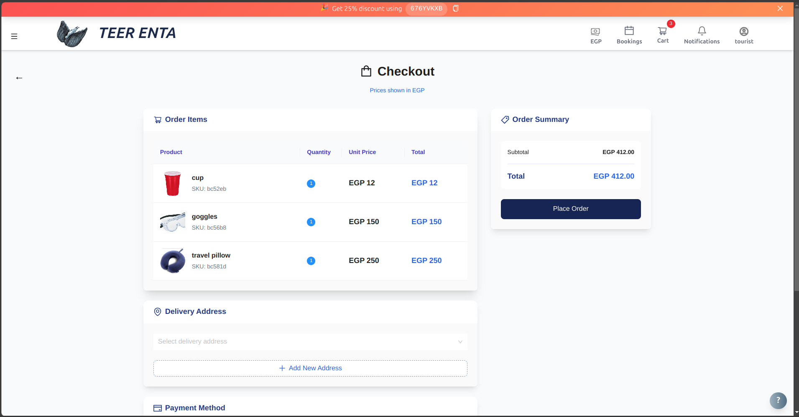
        <p><b>💳 Checkout</b></p>
    </td>
    <td align="center" width="33%">
        
        <p><b>📜 Order History</b></p>
    </td>
    <td align="center" width="33%">
        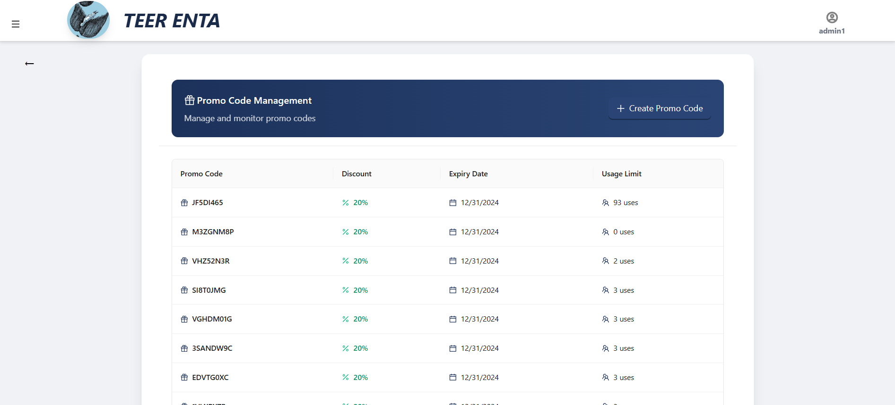
        <p><b>🏷️ Promotions</b></p>
    </td>
</tr>
<tr>
    <td align="center" width="33%">
        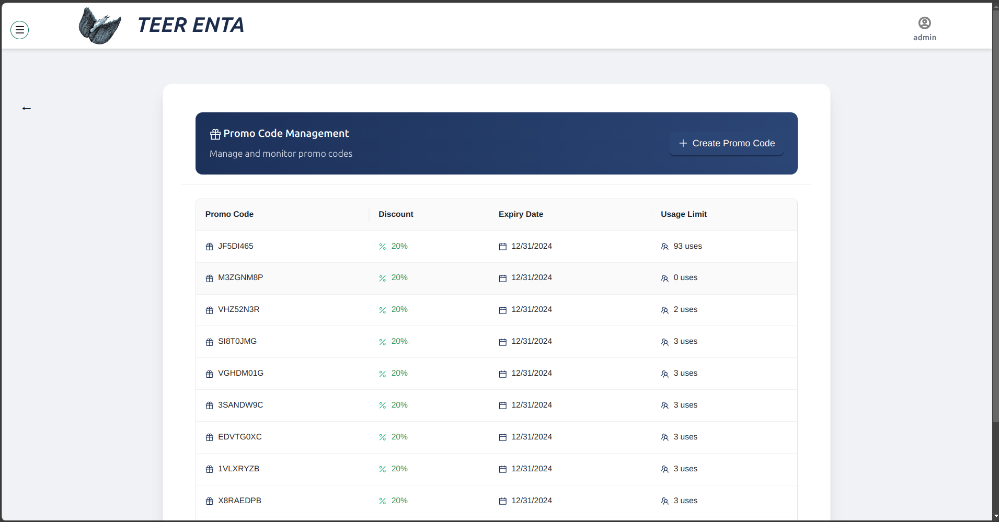
        <p><b>🎟️ Promo Codes</b></p>
    </td>
    <td align="center" width="33%">
        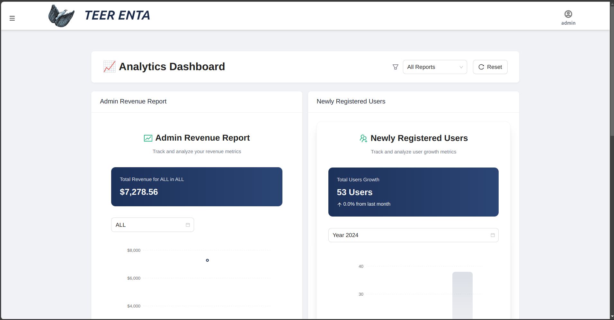
        <p><b>📊 Admin Reports</b></p>
    </td>
    <td align="center" width="33%">
        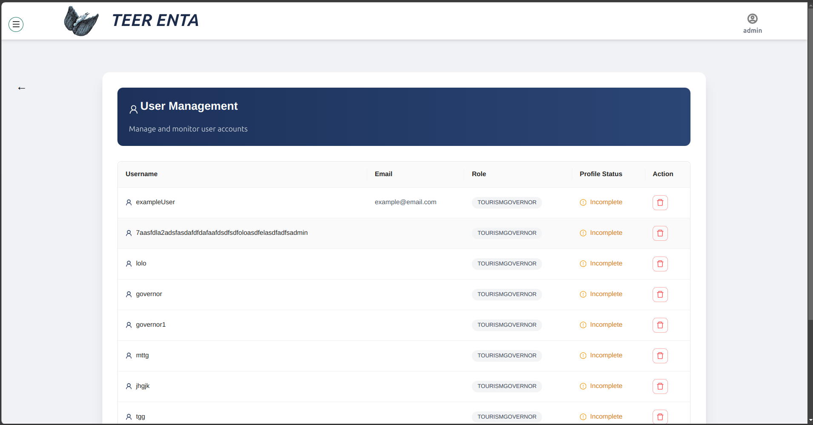
        <p><b>👥 Users Management</b></p>
    </td>
</tr>
</table>

## 🚀 Quick Start

### Prerequisites
- **Node.js** >= 14.x
- **MongoDB** >= 4.x
- **npm** >= 6.x

### Installation

#### Clone the Repository
```bash
git clone https://github.com/MahmoudHH1/Teer-enta.git
```
# Teer Enta - Your Personal Travel Companion

---

## 🚀 Quick Start

### Install Backend Dependencies
```bash
cd backend
npm install
```

###Install Frontend Dependencies
```bash
cd frontend
npm install
```
###Environment Setup

# In the backend directory
```bash
cp .env.example .env
```
# Add your environment variables
###Start Development Servers

# Terminal 1: Start Backend
```bash
npm run dev
```
# Terminal 2: Start Frontend
```bash
npm start
```

## 📚 API Documentation

### 🔐 Authentication
| Method | Endpoint              | Description               |
|--------|-----------------------|---------------------------|
| POST    | `/auth/signup`                           | Register a new user.                           |
| POST    | `/auth/login`                            | Log in a user.                                 |
| POST    | `/auth/changePassword`                   | Change the password for the authenticated user.|
| POST    | `/auth/toggleFirstLoginAndUpdatePrefrences` | Update first-login status and user preferences.|
| POST    | `/auth/changeAllPasswords`               | Change passwords for all users (admin action). |
| POST    | `/auth/forgotPassword`                   | Initiate the password recovery process.        |
| POST    | `/auth/resetPassword`                    | Reset the password using a recovery token.     |


### 👥 Account
| Method | Endpoint              | Description               |
|--------|-----------------------|---------------------------|
| GET     | `/account/accepted`                          | Get all accepted users (requires authentication).         |
| GET     | `/account/pending`                           | Get all pending users (requires authentication).          |
| GET     | `/account/all`                               | Get all users (requires authentication).                  |
| GET     | `/account/preferences`                       | Get all user preferences.                                 |
| GET     | `/account/suggestedActivites`                | Get suggested activities for the user (requires authentication). |
| GET     | `/account/suggestedItinerary`                | Get suggested itinerary for the user (requires authentication). |
| GET     | `/account/requestedAccountsDeletion`         | Get all account deletion requests (requires authentication). |
| POST    | `/account/create`                            | Create a new user account (requires authentication).       |
| POST    | `/account/requestAccountDeletion`            | Request deletion of the authenticated user's account.      |
| POST    | `/account/acceptTermsAndConditions`          | Accept terms and conditions (requires authentication).     |
| PUT     | `/account/choosePreferences`                 | Choose user preferences (requires authentication).         |
| PATCH   | `/account/reject/:id`                        | Reject a user request by ID (requires authentication).     |
| PATCH   | `/account/accept/:id`                        | Accept a user request by ID (requires authentication).     |
| PATCH   | `/account/upload/idCard`                     | Upload an ID card.                                         |
| PATCH   | `/account/upload/taxationCard`               | Upload a taxation registry (requires authentication).      |
| PATCH   | `/account/upload/certificates`               | Upload user certificates (requires authentication).        |
| PATCH   | `/account/redeemPoints`                      | Redeem user points (requires authentication).              |
| PATCH   | `/account/receiveBadge`                      | Receive a badge (requires authentication).                 |
| PATCH   | `/account/chooseCurrency/:id`                | Choose a preferred currency by ID (requires authentication). |
| DELETE  | `/account/delete/:id`                        | Delete a user account by ID (requires authentication).     |
| DELETE  | `/account/approveDeleteRequest/:id`          | Approve a user's account deletion request by ID (requires authentication). |
| DELETE  | `/account/rejectDeleteRequest/:id`           | Reject a user's account deletion request by ID (requires authentication). |


### 👤 Profile
| Method | Endpoint              | Description               |
|--------|-----------------------|---------------------------|
| GET     | `/Profile/:id`                               | Get a user's profile by ID (requires authentication).     |
| GET     | `/Profile/all/addresses`                     | Get all saved addresses for the user (requires authentication). |
| GET     | `/Profile/saved/activities`                  | Get all saved activities for the user (requires authentication). |
| POST    | `/Profile/save/activity/:id`                 | Save an activity by ID to the user's profile (requires authentication). |
| DELETE  | `/Profile/remove/activity/:id`               | Remove a saved activity by ID from the user's profile (requires authentication). |
| POST    | `/Profile/create/:id`                        | Create a profile for the user by ID (requires authentication). |
| PUT     | `/Profile/update/:id`                        | Update the user's profile by ID (requires authentication). |
| PUT     | `/Profile/add/address`                       | Add an address to the user's profile (requires authentication). |
| PUT     | `/Profile/update/picture/:id`                | Update the user's profile picture by ID (requires authentication). |


### 🏃‍♂️ Activities
| Method | Endpoint              | Description               |
|--------|-----------------------|---------------------------|
| GET     | `/activity/`                                 | Get all activities.                                      |
| GET     | `/activity/my`                               | Get activities created by the authenticated user.       |
| GET     | `/activity/upcoming`                         | Get upcoming activities.                                |
| GET     | `/activity/upcoming/paid`                    | Get upcoming paid activities (requires authentication). |
| GET     | `/activity/flagged`                          | Get flagged activities (requires authentication).       |
| GET     | `/activity/one/:id`                          | Get a specific activity by ID.                         |
| GET     | `/activity/:id/ratings`                      | Get ratings for a specific activity by ID.             |
| GET     | `/activity/:id/comments`                     | Get comments for a specific activity by ID.            |
| GET     | `/activity/booked`                           | Get booked activities (requires authentication).        |
| GET     | `/activity/pendingBookings`                  | Get pending bookings (requires authentication).         |
| GET     | `/activity/completedBookings`                | Get completed bookings (requires authentication).       |
| GET     | `/activity/unactive`                         | Get inactive activities (requires authentication).      |
| POST    | `/activity/create`                           | Create a new activity (requires authentication).        |
| POST    | `/activity/activate/:id`                     | Activate an activity by ID (requires authentication).   |
| POST    | `/activity/deactivate/:id`                   | Deactivate an activity by ID (requires authentication). |
| POST    | `/activity/book/:id`                         | Book an activity by ID (requires authentication).       |
| POST    | `/activity/:id/rate`                         | Add a rating to an activity by ID (requires authentication). |
| POST    | `/activity/:id/comment`                      | Add a comment to an activity by ID (requires authentication). |
| POST    | `/activity/makeAllActivitesAppropriate`      | Mark all activities as appropriate.                     |
| PUT     | `/activity/update/:id`                       | Update an activity by ID (requires authentication).     |
| PATCH   | `/activity/flagInappropriate/:id`            | Flag an activity as inappropriate by ID (requires authentication). |
| PATCH   | `/activity/UnFlagInappropriate/:id`          | Unflag an inappropriate activity by ID (requires authentication). |
| PATCH   | `/activity/cancel/book/:id`                  | Cancel a booking for an activity by ID (requires authentication). |
| DELETE  | `/activity/delete/:id`                       | Delete an activity by ID (requires authentication).     |


### 🗺️ Itineraries
| Method | Endpoint              | Description               |
|--------|-----------------------|---------------------------|
| GET     | `/itinerary/`                                  | Get all itineraries.                                      |
| GET     | `/itinerary/one/:id`                            | Get a specific itinerary by ID.                           |
| GET     | `/itinerary/my`                                 | Get itineraries created by the authenticated user.        |
| GET     | `/itinerary/upcoming`                           | Get upcoming itineraries.                                |
| GET     | `/itinerary/upcoming/paid`                      | Get upcoming paid itineraries (requires authentication).  |
| GET     | `/itinerary/flagged`                            | Get flagged itineraries.                                  |
| GET     | `/itinerary/:id/comments`                       | Get comments for a specific itinerary by ID.              |
| GET     | `/itinerary/:id/ratings`                        | Get ratings for a specific itinerary by ID.               |
| GET     | `/itinerary/booked`                             | Get booked itineraries (requires authentication).         |
| GET     | `/itinerary/pendingBookings`                    | Get pending bookings (requires authentication).           |
| GET     | `/itinerary/completedBookings`                  | Get completed bookings (requires authentication).         |
| GET     | `/itinerary/unActive`                           | Get inactive itineraries (requires authentication).       |
| POST    | `/itinerary/create`                             | Create a new itinerary (requires authentication).         |
| POST    | `/itinerary/book/:id`                           | Book an itinerary by ID (requires authentication).        |
| POST    | `/itinerary/activate/:id`                       | Activate an itinerary by ID (requires authentication).    |
| POST    | `/itinerary/deactivated/:id`                    | Deactivate an itinerary by ID.                            |
| POST    | `/itinerary/:id/comment`                        | Add a comment to an itinerary by ID (requires authentication). |
| POST    | `/itinerary/:id/rating`                         | Add a rating to an itinerary by ID (requires authentication). |
| POST    | `/itinerary/makeAllActivitesAppropriate`        | Mark all itineraries as appropriate.                      |
| PUT     | `/itinerary/update/:id`                         | Update an itinerary by ID (requires authentication).      |
| PATCH   | `/itinerary/flagInappropriate/:id`              | Flag an itinerary as inappropriate by ID (requires authentication). |
| PATCH   | `/itinerary/UnFlagInappropriate/:id`            | Unflag an inappropriate itinerary by ID (requires authentication). |
| PATCH   | `/itinerary/cancel/book/:id`                    | Cancel a booking for an itinerary by ID (requires authentication). |
| DELETE  | `/itinerary/delete/:id`                         | Delete an itinerary by ID (requires authentication).      |

### 🏰 Historical Places
| Method | Endpoint              | Description               |
|--------|-----------------------|---------------------------|
| GET     | `/historicalPlace/`                        | Get all historical places.                                  |
| GET     | `/historicalPlace/one/:id`                 | Get a specific historical place by ID.                       |
| GET     | `/historicalPlace/my`                      | Get historical places created by the authenticated user.    |
| GET     | `/historicalPlace/upcoming`                | Get upcoming historical places.                              |
| POST    | `/historicalPlace/create`                  | Create a new historical place (requires authentication).     |
| PUT     | `/historicalPlace/update/:id`              | Update a historical place by ID (requires authentication).   |
| DELETE  | `/historicalPlace/delete/:id`              | Delete a historical place by ID (requires authentication).   |

### 🗂️ Activity Categories
| Method | Endpoint              | Description               |
|--------|-----------------------|---------------------------|
| GET     | `/activityCategory/`                       | Get all activity categories.                              |
| POST    | `/activityCategory/create`                 | Create a new activity category (requires authentication). |
| PUT     | `/activityCategory/update/:id`             | Update an activity category by ID (requires authentication). |
| DELETE  | `/activityCategory/delete/:id`             | Delete an activity category by ID (requires authentication). |

### 🏷️ Tags
| Method | Endpoint              | Description               |
|--------|-----------------------|---------------------------|
| GET     | `/tag/`                           | Get all tags.                                         |
| POST    | `/tag/create`                      | Create a new tag (requires authentication).          |
| PUT     | `/tag/update/:id`                  | Update a tag by ID (requires authentication).        |
| DELETE  | `/tag/delete/:id`                  | Delete a tag by ID (requires authentication).        |

### 🏷️ Preference Tags
| Method | Endpoint              | Description               |
|--------|-----------------------|---------------------------|
| GET     | `/preferenceTag/`                      | Get all preference tags.                                      |
| POST    | `/preferenceTag/create`                | Create a new preference tag (requires authentication).         |
| PUT     | `/preferenceTag/update/:id`            | Update a preference tag by ID (requires authentication).       |
| DELETE  | `/preferenceTag/delete/:id`            | Delete a preference tag by ID (requires authentication).       |

### 📦 Product
| Method | Endpoint              | Description               |
|--------|-----------------------|---------------------------|
| GET     | `/product/`                            | Get all products.                                           |
| GET     | `/product/archived`                     | Get archived products (requires authentication).            |
| GET     | `/product/one/:id`                      | Get a specific product by ID.                               |
| GET     | `/product/salesAndQuantity`             | View available quantity and sales (requires authentication).|
| GET     | `/product/:id/ratings`                  | Get ratings for a specific product by ID.                   |
| GET     | `/product/:id/reviews`                  | Get reviews for a specific product by ID.                   |
| POST    | `/product/create`                       | Create a new product (requires authentication).             |
| POST    | `/product/:id/rate`                     | Add a rating to a specific product by ID (requires authentication). |
| POST    | `/product/:id/review`                   | Add a review to a specific product by ID (requires authentication). |
| PUT     | `/product/update/:id`                   | Update a product by ID (requires authentication).           |
| PATCH   | `/product/archive/:id`                  | Archive a product by ID (requires authentication).          |
| PATCH   | `/product/unArchive/:id`                | Unarchive a product by ID (requires authentication).        |

### 🛍️ Cart
| Method | Endpoint              | Description               |
|--------|-----------------------|---------------------------|
| GET     | `/cart/wishlist`                        | Get the wishlist of the authenticated user.                  |
| GET     | `/cart/`                                | Get the cart of the authenticated user.                      |
| POST    | `/cart/add/wishlist/product/:id`        | Add a product to the wishlist (requires authentication).     |
| POST    | `/cart/add/cartFromWishlist/product/:id`| Add a product to the cart from the wishlist (requires authentication). |
| POST    | `/cart/add/cart/product/:id`            | Add a product to the cart (requires authentication).         |
| PATCH   | `/cart/update/cart/productAmount/:id`   | Update the amount of a product in the cart (requires authentication). |
| DELETE  | `/cart/delete/wishlist/product/:id`     | Delete a product from the wishlist (requires authentication).|
| DELETE  | `/cart/delete/cart/product/:id`         | Delete a product from the cart (requires authentication).    |

### 🛒 Order
| Method | Endpoint              | Description               |
|--------|-----------------------|---------------------------|
| GET     | `/order/`                             | Get all orders for the authenticated user.                      |
| GET     | `/order/current`                      | Get current orders for the authenticated user.                   |
| GET     | `/order/history`                      | Get order history for the authenticated user.                    |
| GET     | `/order/one/:id`                      | Get a specific order by ID (requires authentication).            |
| GET     | `/order/cartDetails`                  | Get details of the current cart (requires authentication).       |
| POST    | `/order/checkOut`                     | Check out the order (requires authentication).                   |
| PATCH   | `/order/cancel/:id`                   | Cancel a specific order by ID (requires authentication).         |

### 👨‍💼 Tour Guide
| Method | Endpoint              | Description               |
|--------|-----------------------|---------------------------|
| GET     | `/tourGuide/:id/ratings`              | Get ratings for a specific tour guide by ID.                    |
| GET     | `/tourGuide/:id/comments`             | Get comments for a specific tour guide by ID.                   |
| POST    | `/tourGuide/:id/rate`                 | Rate a specific tour guide by ID (requires authentication).     |
| POST    | `/tourGuide/:id/comment`              | Comment on a specific tour guide by ID (requires authentication).|

### 🚗 Transportation
| Method | Endpoint              | Description               |
|--------|-----------------------|---------------------------|
| GET     | `/transportation/`                        | Get all available transportations.                           |
| GET     | `/transportation/:id`                     | Get details of a specific transportation by ID.              |
| GET     | `/transportation/booked/all`              | Get all booked transportations for the authenticated user.   |
| POST    | `/transportation/create`                  | Create a new transportation (requires authentication).       |
| POST    | `/transportation/book/:id`                | Book a specific transportation by ID (requires authentication).|

### ✈️ Flights
| Method | Endpoint              | Description               |
|--------|-----------------------|---------------------------|
| GET     | `/flights/getAirports`                    | Get a list of available airports.                            |
| GET     | `/flights/getFlightOffers`                | Get available flight offers.                                |
| GET     | `/flights/booked`                         | Get all booked flights for the authenticated user.           |
| POST    | `/flights/bookFlight`                     | Book a flight (requires authentication).                    |

### 🏨 Hotels
| Method | Endpoint              | Description               |
|--------|-----------------------|---------------------------|
| GET     | `/hotels/getHotelOffers`                  | Get available hotel offers.                                |
| POST    | `/hotels/bookHotel`                       | Book a hotel (requires authentication).                   |
| GET     | `/hotels/booked`                          | Get all booked hotels for the authenticated user.          |

### 💳 Payment
| Method | Endpoint              | Description               |
|--------|-----------------------|---------------------------|
| POST   | `/payment/create-payment-intent`        | Create a payment intent (requires authentication).         |

### 📜 Complaint
| Method | Endpoint              | Description               |
|--------|-----------------------|---------------------------|
| GET     | `/complaint/`                            | Get all complaints (requires authentication).             |
| GET     | `/complaint/my`                          | Get the authenticated user's complaints.                  |
| GET     | `/complaint/one/:id`                     | Get a specific complaint by ID (requires authentication). |
| POST    | `/complaint/create`                      | Create a new complaint (requires authentication).         |
| PUT     | `/complaint/update/:id`                  | Update a complaint by ID (requires authentication).       |

### 📂 Upload
| Method | Endpoint              | Description               |
|--------|-----------------------|---------------------------|
| POST   | `/upload/file`                          | Upload a single file (requires authentication).           |
| POST   | `/upload/files`                         | Upload multiple files (requires authentication).         |

### 💰 Currency
| Method | Endpoint              | Description               |
|--------|-----------------------|---------------------------|
| GET     | `/currency/`                             | Get all currencies.                                        |
| GET     | `/currency/getMyCurrency`                | Get the authenticated user's currency. (requires authentication) |
| POST    | `/currency/add`                          | Add a new currency.                                        |
| POST    | `/currency/addMultiple`                  | Add multiple currencies.                                  |
| DELETE  | `/currency/`                              | Delete all currencies.                                     |

### 🎟️ Promocode
| Method | Endpoint              | Description               |
|--------|-----------------------|---------------------------|
| GET     | `/promoCode/`                           | Get all promo codes. (requires authentication)              |
| GET     | `/promoCode/latestPromoCode`            | Get the latest promo code.                                 |
| POST    | `/promoCode/create`                     | Create a new promo code. (requires authentication)          |
| POST    | `/promoCode/apply`                      | Apply a promo code. (requires authentication)               |

### 📊 Statistics
| Method | Endpoint              | Description               |
|--------|-----------------------|---------------------------|
| GET     | `/statistics/totalUsers`                 | Get the total number of users. (requires authentication)   |
| GET     | `/statistics/newUsersPerMonth`           | Get the number of new users per month. (requires authentication) |
| GET     | `/statistics/report/adminRevenue`        | Get the admin revenue report. (requires authentication)    |
| GET     | `/statistics/report/itinerary`           | Get the itinerary report. (requires authentication)         |
| GET     | `/statistics/report/activity`            | Get the activity report. (requires authentication)          |
| GET     | `/statistics/report/transportation`      | Get the transportation report. (requires authentication)    |
| GET     | `/statistics/report/order`               | Get the product report. (requires authentication)           |

### 🔔 Notification
| Method | Endpoint              | Description               |
|--------|-----------------------|---------------------------|
| GET     | `/notification/my`                        | Get all notifications for the authenticated user. (requires authentication) |
| GET     | `/notification/myRequest/:activityId`     | Get the notification request for a specific activity. (requires authentication) |
| GET     | `/notification/allMyRequests`             | Get all notification requests for the authenticated user. (requires authentication) |
| POST    | `/notification/createRequest`             | Create a new notification request. (requires authentication) |
| POST    | `/notification/send`                      | Send a notification. |
| POST    | `/notification/saveFCMToken`              | Save FCM token for push notifications. (requires authentication) |
| POST    | `/notification/markAllAsRead`             | Mark all notifications as read. (requires authentication) |
| POST    | `/notification/markAsRead/:id`            | Mark a specific notification as read. (requires authentication) |
| PATCH   | `/notification/updateRequestStatus`       | Update the status of a notification request. (requires authentication) |
| DELETE  | `/notification/delete/:id`                | Delete a specific notification. (requires authentication) |
| DELETE  | `/notification/my`                        | Delete all notifications for the authenticated user. (requires authentication) |

---

## 🧪 API Testing with Postman

In this project, API testing was done using Postman to ensure that all routes and endpoints are working as expected. Below is the Postman collection link for the tests performed on the API.

### 🗂️ Postman Collection

You can access and run the Postman collection by clicking on the link below. This collection contains all the API endpoints tested for this project:

- [**Teer-Enta API Collection**](https://sta-api-test.postman.co/workspace/Teer-Enta~ccec1157-f214-4cef-95ac-3d9b58d1be36/collection/35577203-17260410-0009-4eb2-9c0d-ddd2f47162c5?action=share&creator=36552423) :rocket:

### 🔧 How to Use the Postman Collection
1. **Import the Collection**:
    - Click the link above to access the Postman collection.
    - Once inside Postman, click on "Import" and paste the link to the collection or directly import the collection into Postman. 📥
   
2. **Environment Setup**:
    - You may need to set up the environment variables such as `API_URL`, `JWT_TOKEN`, etc., in Postman. ⚙️
    - These variables can be configured in the "Environment" section of Postman.

3. Start the backend server
```bash
  cd backend
```

```bash
  npm start
```

3. **Run the Tests**:
    - Once the collection is imported, you can run individual API requests or the entire collection. ▶️
    - The collection contains all endpoints used in this project, with example requests and responses.

---
## 🤝 Contributing

We’d love your input!  

### Steps to Contribute:
1. **Fork the Project**  
2. **Create Your Feature Branch**  
   ```bash
   git checkout -b feature/yourFeature
   ```
3. **Commit Your Chnages
 ```bash
   git commit -m 'your commit message'
 ```
4. **Push to the Branch
 ```bash
   git push origin main feature/yourFeature
```
5.
 ```bash
  gh auth login
 gh pr create --base main --head feature/yourFeature --title "pull request title"
```

## 👏 Credits

- **Contributors**:  
- [](https://github.com/MahmoudHH1)
- [](https://github.com/MohamedElsaeed424)
- [](https://github.com/youssefmmagdy)
- [](https://github.com/omarabushanab)
- [](https://github.com/mahmoudahroug)
- [](https://github.com/helguindy)
- [](https://github.com/Raed108)
- [](https://github.com/omar-medhat2)
- [](https://github.com/ZeyadAttia-Tek)
- [](https://github.com/Ahmed-cmd-web)


 
  

- **Inspiration**:  
  - [React - The Complete Guide (incl. Redux)](https://www.udemy.com/course/react-the-complete-guide-incl-redux/?kw=react&src=sac&couponCode=24T3MT120924)  
  - [NodeJS - The Complete Guide (MVC, REST APIs, GraphQL, Deno)](https://www.udemy.com/course/nodejs-the-complete-guide/?couponCode=24T3MT120924) 


## 📄 Licenses

This project uses multiple dependencies, each under its respective license. Below is a breakdown of the licenses included:

- **MIT**: 1293 dependencies
- **ISC**: 100 dependencies
- **Apache-2.0**: 85 dependencies
- **BSD-3-Clause**: 44 dependencies
- **CC0-1.0**: 42 dependencies
- **BSD-2-Clause**: 40 dependencies
- **BlueOak-1.0.0**: 3 dependencies
- **0BSD**: 3 dependencies
- **(MIT OR CC0-1.0)**: 3 dependencies
- **CC-BY-4.0**: 2 dependencies
- **Unlicense**: 2 dependencies
- **MIT\***: 2 dependencies
- **Python-2.0**: 1 dependency
- **MPL-2.0**: 1 dependency
- **BSD**: 1 dependency
- **UNLICENSED**: 1 dependency
- **(Apache-2.0 OR MPL-1.1)**: 1 dependency
- **(AFL-2.1 OR BSD-3-Clause)**: 1 dependency
- **(BSD-3-Clause OR GPL-2.0)**: 1 dependency
- **(MIT AND Zlib)**: 1 dependency
- **MIT AND ISC**: 1 dependency

### Notes
- If you'd like to view the full details of each license, you can use tools like `license-checker` or check the individual dependencies in the `node_modules` directory.
- Some dependencies may have multiple or combined licenses (e.g., `(MIT OR CC0-1.0)`).

# How to Use the Website

This section provides an overview of how different users can navigate and use the web application.

---

## Seller
- **From Home**:  
  - View the dashboard.  
  - Navigate to Notifications, Profile, or Products.  
- **From Profile Page**:  
  - Change password.  
  - Edit profile.  
  - Request account deletion.  
  - Change profile photo.  
- **From Products**:  
  - View all products.  
  - Add a product.  
  - Search and filter products.  
  - See remaining item quantities and revenue.  

---

## Tour Guide
- **From Home**:  
  - View the dashboard.  
  - Navigate to Notifications, Profile, or Itineraries.  
- **From Profile Page**:  
  - Change password.  
  - Edit profile.  
  - Request account deletion.  
  - Change profile photo.  
  - Add previous works.  
- **From Itineraries**:  
  - View all itineraries.  
  - Add an itinerary.  
  - Edit my itineraries.  

---

## Advertiser
- **From Home**:  
  - View the dashboard.  
  - Navigate to Notifications, Profile, Activities, or Create Transportation.  
- **From Profile Page**:  
  - Change password.  
  - Edit profile.  
  - Request account deletion.  
  - Change profile photo.  
- **From Activities**:  
  - View all activities.  
  - Add an activity.  
  - Edit my activities.  
- **From Create Transportation**:  
  - Create a transportation entry.  

---

## Tourist
- **From Home**:  
  - View historical places.  
  - See suggested activities and itineraries.  
  - Navigate to Notifications, Profile, Cart, Bookings, Transportations, Hotels, Flights, Products, Complaints.  
- **From Profile Page**:  
  - Change password.  
  - Edit profile.  
  - Request account deletion.  
  - See my balance.  
- **From Itineraries**:  
  - View all itineraries.  
  - Book an itinerary.  
- **From Historical Places**:  
  - View all historical places.  
- **From Activities**:  
  - View all activities.  
  - Book activities.  
- **From Products**:  
  - View all products.  
  - Buy products.  
- **From Book Transportation**:  
  - View all transportations.  
  - Book transportation.  
- **From Book Hotel**:  
  - View all hotels.  
  - Book a hotel.  
- **From Book Flight**:  
  - View all flights.  
  - Book a flight.  
- **From Complaints**:  
  - View my complaints.  
  - Create a complaint.  

---

## Tourism Governor
- **From Home**:  
  - View the dashboard.  
  - Navigate to Change Password, Historical Places, or Tags.  
- **From Tags**:  
  - View all tags.  
  - Create tags.  
- **From Historical Places**:  
  - View all historical places.  
  - Create historical places.  

---

## Admin
- **From Home**:  
  - View the dashboard.  
  - Navigate to Change Password, Historical Places, Tags, Itineraries, Activities, Products, Users, Complaints, and Promo Codes.  
- **From Tags**:  
  - View all tags.  
- **From Preference Tags**:  
  - View all preference tags.  
  - Create preference tags.  
- **From Historical Places**:  
  - View all historical places.  
- **From Itineraries**:  
  - View all itineraries.  
  - Flag itineraries.  
- **From Activities**:  
  - View all activities.  
  - Flag activities.  
- **From Products**:  
  - View all products.  
  - Add a product.  
- **From Users**:  
  - View all users.  
  - View pending users.  
  - Add a user.  
  - Decide on account deletion.  
- **From Complaints**:  
  - Reply to complaints.  
  - View complaints.  
- **From Promo Codes**:  
  - View all promo codes.  
  - Create promo codes.  
