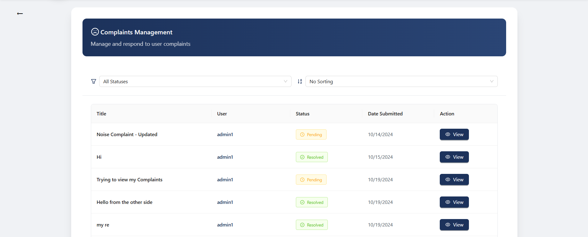

# 🌍 Teer Enta - Your Personal Travel Companion

<div align="center">
  
</div>

---

### 🚀 Revolutionizing Travel Planning

Teer Enta brings together personalized recommendations, seamless booking, and smart budgeting into one intuitive platform. Built with the **MERN stack**, it's your ultimate companion for crafting unforgettable travel experiences.

---

## ✨ Overview

Teer Enta combines technology and travel to simplify your planning process. From smart itinerary suggestions to budget tracking and real-time updates, Teer Enta ensures you focus on the journey, not the logistics.  

**Current Version:** `1.0.0`  
**Development Stage:** **Beta**

---

## 🎯 Motivation

*Why Teer Enta?*  
Travel planning can often feel overwhelming, with countless websites and tools required to organize a single trip. From researching destinations to booking accommodations and managing budgets, travelers frequently find themselves juggling multiple platforms.
We created Teer Enta to simplify and streamline the travel experience. Our goal is to provide:
- A single platform for planning, booking, and managing trips.
- An intuitive interface for tourists, sellers, and tour guides.
- Features that empower users to discover unique experiences and make informed decisions.
By combining personalization, seamless transactions, and comprehensive planning tools, this app ensures stress-free travel, enabling users to focus on creating memories rather than logistics.

## 🧱 Build Status

The current build status reflects whether the project is successfully building and passing all tests:

- **✅ Passing**: The latest on commit main branch is stable and free of errors.

---

## 🎨 Code Styles
This section outlines the coding standards and best practices followed in the development of this **MERN** stack project to maintain clean, readable, and maintainable code. 

---

### 1. 🖥️ **JavaScript and Node.js Code Style (Backend)**
- **ESLint**:  ESLint is configured to enforce consistent coding styles, catch potential errors, and improve overall code quality.
- **Prettier**:  Prettier is integrated to automatically format code according to a uniform style, ensuring consistency across the project.
- **Modularization**:  The backend code is broken into modular components such as controllers, models, routes, and middlewares to enhance reusability and maintainability.
- **Naming Conventions**: 
  - Variables and functions use **camelCase** .
  - Classes use **PascalCase** .
- **Error Handling**:  Custom error classes and middleware are used to handle errors consistently and provide meaningful API responses.

---

### 2. ⚛️ **React Code Style (Frontend)**
- **Component Organization**: 
  -  Functional components with hooks are used over class components for cleaner, more modern React code.
  -  Components are organized in feature-based directories for better maintainability.
- **JSX Formatting**: 
  -  Proper indentation is maintained in JSX.
  -  Self-closing tags are used when applicable.
- **State Management**: 
  -  Redux/React Context (if applicable) is used for state management, following the principles of unidirectional data flow.
- **Styling**: 
  -  Styling is handled via Tailwind-Css for modular and maintainable styles.
- **Prop Types / TypeScript**: 
  -  **PropTypes** or **TypeScript** are used to provide type safety for props and state, ensuring better code reliability.

---

### 3. 🗃️ **MongoDB & Mongoose Code Style**
- **Schema Design**: 
  -  MongoDB schemas are designed using Mongoose, following consistent naming conventions for model names and fields.
  -  Validation and default values are implemented where appropriate.
- **Query Optimization**: 
  -  Queries are optimized to avoid performance bottlenecks, such as using indexes and limiting the number of records returned.
- **Population and Referencing**: 
  -  Efficient use of Mongoose’s `populate()` to handle relationships between models and avoid unnecessary queries.
---

## 🛠️ Tech Stack

### Frontend
- ⚛️ **React.js**
- 🔄 **Redux**
- 🎨 **Ant-Design** / **Tailwind CSS**
- 🧭 **React Router**

### Backend
- 📦 **Node.js**
- 🚂 **Express.js**
- 🍃 **MongoDB**
- 🔍 **Mongoose**

### Tools & Deployment
- 📊 **Git** & **GitHub**
- 🚀 Deployment on [Your Platform]
- 🔐 **JWT Authentication**
- 📡**Cloudinary**
- **Firebase** 

---

## 📜 Code Examples

In this section, we provide examples of key parts of the codebase to demonstrate the functionality and practices implemented throughout the MERN stack project.

### 1. 🌐 **Express Server Setup (Backend)**
Here’s an example of how we set up our Express server with basic configurations and routes.

## 📜 Code Examples

### 1. 🌐 **Express Server Setup** (Backend)
In this section, we provide a simplified version of how the server is set up and connected to the database.

```javascript
const express = require("express");
const mongoose = require("mongoose");
const morgan = require("morgan");
const cors = require("cors");
const app = express();
const dbUrl = process.env.DB_URL;
const PORT = process.env.PORT || 8000;

// Middleware setup
app.use(morgan('dev'));
app.use(cors());
app.use(express.json());

// Connect to MongoDB
mongoose.connect(dbUrl).then(() => {
  console.log('Connected to DB');
}).catch((error) => {
  console.error('Could not connect to DB.', error);
});
```

### 2.🧩 Route Setup Example (Backend)
This example demonstrates how routes are set up for handling requests in the application.
```javascript
const activityRoutes = require('./routes/activity');
const itineraryRoutes = require('./routes/Itinerary');

// Using the routes
app.use("/activity", activityRoutes);
app.use("/itinerary", itineraryRoutes);
```

### 3.🔄 Socket Initialization (Backend)
We are using http and a custom socket initialization for real-time features.
```javascript
const http = require('http');
const { initSocket } = require("./Util/socket");

const server = http.createServer(app);
initSocket(server);

// Start server
server.listen(PORT, () => {
  console.log(`Server is running on port ${PORT}`);
});
```

### 4.⚠️ 404 Error Handling (Backend)
Handling undefined routes with a simple 404 error response.
```javascript
app.use((req, res) => {
  res.status(404).json({ message: "This page doesn't exist" });
});
```

### 5.🔒 JWT Authentication Middleware (Backend)
```javascript
const jwt = require("jsonwebtoken");
const Token = require("../models/Users/Token");
const errorHandler = require("../Util/ErrorHandler/errorSender");

module.exports = async (req, res, next) => {
    const authHeader = req.headers["authorization"];
    if (!authHeader) {
        return res.status(401).json({ message: "Not Authenticated" });
    }
    const token = authHeader.split(" ")[1];
    let decodedToken;

    try {
        decodedToken = jwt.verify(token, process.env.JWT_SECRET_ACCESS);
        if (!decodedToken) {
            return res.status(401).json({ message: "Token is Not Correct" });
        }

        const checkToken = await Token.findOne({ token: token });
        if (!checkToken) {
            return res.status(403).json({ message: "Login first" });
        }

        if (checkToken.blackListedToken) {
            return res.status(403).json({
                message: "You are blocked, You cannot perform this request",
            });
        }

        req.user = {
            _id: decodedToken.userId,
            hasProfile: decodedToken.hasProfile,
            role: decodedToken.userRole ,
            accessToken: token
        };
        req.body.createdBy = req.user._id ;
        next();

    } catch (err) {
        errorHandler.SendError(res, err);
    }
};
```

### 6.🗃️ Mongoose Schema (Backend)

```javascript
const mongoose = require('mongoose');

const ActivitySchema = new mongoose.Schema({
    name: {type: String, required: true},
    date: {type: Date, required: true},
    time: {type: String, required: true},
    imageUrl: {type: String},
    isBookingOpen: {type: Boolean, default: true},
    location: {
        lat: {type: Number, required: true},
        lng: {type: Number, required: true}
    },
    isActive: {type: Boolean, default: true},
    isAppropriate :{type:Boolean , default:true} ,
    price: {
        min: Number,
        max: Number
    },
    category: {type: mongoose.Schema.Types.ObjectId, ref: 'ActivityCategory'},
    preferenceTags: [{type: mongoose.Schema.Types.ObjectId, ref: 'PreferenceTags'}],
    specialDiscounts: [
        {
            discount: Number,
            Description: String,
            isAvailable: {type: Boolean, default: false}
        }
    ],
    ratings: [{
        user: {type: mongoose.Schema.Types.ObjectId, ref: 'User'},
        rating: Number ,
        createdAt: {type: Date, default: Date.now}
    }],
    comments: [{
        user: {type: mongoose.Schema.Types.ObjectId, ref: 'User'},
        comment: String,
        createdAt: {type: Date, default: Date.now}
    }],
    createdBy: {type: mongoose.Schema.Types.ObjectId, ref: 'User'},

}, {timestamps: true});

module.exports = mongoose.model('Activity', ActivitySchema);
```

### 7.⚛️ React Component example (frontend)
  PreferenceTags Component Examples
    This document breaks down the PreferenceTags component into reusable code sections. Each example demonstrates a specific functionality of the component.
    Table of Contents
      # Project Documentation

| **Section**         | **Description**                                                                                                                                           |
|---------------------|-----------------------------------------------------------------------------------------------------------------------------------------------------------|
| **Basic Setup**      | Initial setup of the project, including environment configuration, necessary dependencies, and project structure.                                          |
| **State Management** | Management of global state for the application using a state management library (e.g., Redux).                                                            |
| **API Integration**  | Integrating APIs to fetch or send data to backend services using RESTful API calls.                                                                       |
| **Table Configuration** | Configuration of tables to display data in a structured format, including sorting and filtering options.                                                |
| **Modal Form**       | Allows users to submit data via a form within a popup/modal window.                                                                                      |
| **Component Layout** | Structure and layout of components, ensuring modularity and responsiveness using grid systems or flexbox.                                                |

### Basic setup

```javascript
    import React, { useState, useEffect } from "react";
    import {
        Table, Button, Modal, Form, Input, Switch,
        ConfigProvider, Tooltip, message
    } from "antd";
    import {
        PlusOutlined, DeleteOutlined, ExclamationCircleOutlined,
        EditOutlined, TagsOutlined, CheckCircleOutlined
    } from "@ant-design/icons";
    
    const { Item } = Form;
    
    const PreferenceTags = ({ setFlag }) => {
        // Component implementation
    };
    
    export default PreferenceTags;
```

### State Management

```javascript
  // State hooks for managing component data and UI
  const [tags, setTags] = useState([]);
  const [loading, setLoading] = useState(true);
  const [submitting, setSubmitting] = useState(false);
  const [modalVisible, setModalVisible] = useState(false);
  const [isEditing, setIsEditing] = useState(false);
  const [currentTag, setCurrentTag] = useState(null);
  const [form] = Form.useForm();
  
  useEffect(() => {
      setFlag(false);
      fetchTags();
  }, [setFlag]);
```

### API Integration

```javascript
  // API interaction methods
  const fetchTags = async () => {
      setLoading(true);
      try {
          const response = await getPreferenceTags();
          setTags(response.data);
      } catch (error) {
          message.warning(error.response.data.message);
      } finally {
          setLoading(false);
      }
  };
  
  const handleSubmit = async (values) => {
      setSubmitting(true);
      try {
          if (isEditing) {
              await updatePreferenceTag({ ...currentTag, ...values });
              message.success("Tag updated successfully");
          } else {
              await createPreferenceTag(values);
              message.success("Tag created successfully");
          }
          fetchTags();
          setModalVisible(false);
          form.resetFields();
      } catch (error) {
          message.warning(error.response.data.message);
      } finally {
          setSubmitting(false);
      }
  };
  
  const handleDelete = async (id) => {
      try {
          await deletePreferenceTag(id);
          message.success("Preference Tag deleted successfully")
          fetchTags();
      } catch (error) {
          message.warning(error.response.data.message);
      }
  };
```

### Table configurations

```javascript
  const columns = [
      {
          title: "Tag Name",
          dataIndex: "tag",
          key: "tag",
          render: (text) => (
              <div className="flex items-center">
                  <TagsOutlined className="mr-2 text-[#1C325B]" />
                  <span className="font-medium">{text}</span>
              </div>
          ),
      },
      {
          title: "Status",
          dataIndex: "isActive",
          key: "isActive",
          render: (isActive) => (
              <div className="flex items-center">
                  <CheckCircleOutlined
                      className={`mr-2 ${
                          isActive ? "text-emerald-500" : "text-gray-400"
                      }`}
                  />
                  <span
                      className={
                          isActive ? "text-emerald-600 font-medium" : "text-gray-500"
                      }
                  >
                      {isActive ? "Active" : "Inactive"}
                  </span>
              </div>
          ),
      },
      {
          title: "Actions",
          key: "actions",
          render: (_, record) => (
              // Actions column implementation
          ),
      },
  ];
```

### Modal form 

```javascript
  <Modal
      title={
          <div className="text-lg font-semibold text-[#1C325B]">
              {isEditing ? "Edit Tag" : "Create New Tag"}
          </div>
      }
      open={modalVisible}
      onCancel={() => {
          setModalVisible(false);
          form.resetFields();
      }}
      footer={null}
      className="top-8"
  >
      <Form
          form={form}
          layout="vertical"
          onFinish={handleSubmit}
          className="mt-4"
      >
          <Item
              label={<span className="text-gray-700 font-medium">Tag Name</span>}
              name="tag"
              rules={[{ required: true, message: "Please enter tag name" }]}
          >
              <Input
                  prefix={<TagsOutlined className="text-gray-400" />}
                  placeholder="Enter tag name"
                  className="h-10"
              />
          </Item>
  
          <Item
              label={<span className="text-gray-700 font-medium">Status</span>}
              name="isActive"
              valuePropName="checked"
              initialValue={true}
          >
              <Switch />
          </Item>
  
          <div className="flex justify-end space-x-2 mt-6">
              <Button
                  onClick={() => {
                      setModalVisible(false);
                      form.resetFields();
                  }}
                  disabled={submitting}
                  className="hover:bg-gray-50"
              >
                  Cancel
              </Button>
              <Button
                  type="primary"
                  htmlType="submit"
                  loading={submitting}
                  className="bg-[#1C325B] hover:bg-[#1C325B]/90"
              >
                  {isEditing ? "Update" : "Create"} Tag
              </Button>
          </div>
      </Form>
  </Modal>
```

### Component Layout

```javascript
  return (
      <ConfigProvider
          theme={{
              token: {
                  colorPrimary: "#1C325B",
              },
          }}
      >
          <div className="flex justify-center">
              <div className="p-6 w-[90%]">
                  <div className="max-w-7xl mx-auto">
                      <div className="bg-white rounded-2xl shadow-xl p-8 border border-gray-100">
                          {/* Header Section */}
                          <div className="px-6 py-4 border-b border-gray-200">
                              {/* Header content */}
                          </div>
  
                          {/* Table Section */}
                          <div className="p-6">
                              <Table
                                  columns={columns}
                                  dataSource={tags}
                                  rowKey="_id"
                                  loading={loading}
                                  pagination={{
                                      pageSize: 10,
                                      showTotal: (total) => `Total ${total} tags`,
                                  }}
                                  className="border border-gray-200 rounded-lg"
                                  rowClassName="hover:bg-[#1C325B]/5"
                              />
                          </div>
                      </div>
                  </div>
              </div>
          </div>
      </ConfigProvider>
  );
```

### Usage

```javascript
// Import the component
import PreferenceTags from './components/PreferenceTags';

// Use in your application
function App() {
    const handleFlagChange = (flag) => {
        // Handle flag change
    };

    return (
        <PreferenceTags setFlag={handleFlagChange} />
    );
}
```

---

## ⭐ Features

### 🎯 Personalized Planning
- Smart preference matching
- Custom itinerary builder
- Budget optimization tools

### 🎫 Seamless Bookings
- One-click reservations
- Integrated payment system
- Instant confirmations

### 💰 Smart Budgeting
- Real-time expense tracking
- Cost predictions
- Budget alerts

### 🗺️ Local Discovery
- Hidden gems finder
- Cultural experiences
- Local events calendar

### ⏰ Real-Time Updates
- Booking notifications
- Schedule changes

### ✈️ Comprehensive Travel Planning
- Explore historical places
- Plan customized itineraries for well-organized trips

### 🏨 Seamless Booking Experience
- Book transportation, hotels, and flights
- Full control over destination, time, and airport selection on the same platform
- Effortless hotel configuration and booking

### 🛍️ Integrated Souvenir Shopping
- Buy souvenirs from partnered sellers directly on the website
- Secure payments powered by Stripe

### 💳 Financial Transparency
- Check your wallet or card balance anytime

### 🛒 For Sellers
- Effortless product management
- Edit and update listings easily

### 👨‍💼 For Tour Guides
- Directly contact customers
- View associated itineraries for better coordination
---

## 📸 Screenshots
<div align="center">
  
  <p>Teer Enta Homepage</p>
  
  <p>Historical Places</p>
  
  <p>Flights</p>
  
  <p>Hotels</p>
  
  <p>Promo Table</p>
  
  <p>Complaint Table</p>
  
  <p>Activity Table</p>
</div>

## 🚀 Quick Start

### Prerequisites
- **Node.js** >= 14.x
- **MongoDB** >= 4.x
- **npm** >= 6.x

### Installation

#### Clone the Repository
```bash
git clone https://github.com/MahmoudHH1/Teer-enta.git
```
# Teer Enta - Your Personal Travel Companion

---

## 🚀 Quick Start

### Install Backend Dependencies
```bash
cd backend
npm install
```

###Install Frontend Dependencies
```bash
cd frontend
npm install
```
###Environment Setup

# In the backend directory
```bash
cp .env.example .env
```
# Add your environment variables
###Start Development Servers

# Terminal 1: Start Backend
```bash
npm run dev
```
# Terminal 2: Start Frontend
```bash
npm start
```

## 📚 API Documentation

### 🔐 Authentication
| Method | Endpoint              | Description               |
|--------|-----------------------|---------------------------|
| POST   | `/api/auth/register`  | Register a new user       |
| POST   | `/api/auth/login`     | Log in a user             |
| GET    | `/api/auth/verify`    | Verify user authentication|

### ✈️ Trips
| Method | Endpoint              | Description               |
|--------|-----------------------|---------------------------|
| GET    | `/api/trips`          | Fetch all trips           |
| POST   | `/api/trips`          | Create a new trip         |
| PUT    | `/api/trips/:id`      | Update trip details       |
| DELETE | `/api/trips/:id`      | Delete a trip             |

---

## 🧪 Testing

Run the following commands to test the project:

### Backend Tests
```bash
npm run test:backend
```
###Frontend Tests
```bash
npm run test:frontend
```
## 🤝 Contributing

We’d love your input!  

### Steps to Contribute:
1. **Fork the Project**  
2. **Create Your Feature Branch**  
   ```bash
   git checkout -b feature/yourFeature
   ```
3. **Commit Your Chnages
 ```bash
   git commit -m 'your commit message'
 ```
4. **Push to the Branch
 ```bash
   git push origin main feature/yourFeature
```
5.
 ```bash
  gh auth login
 gh pr create --base main --head feature/yourFeature --title "pull request title"
```

## 👏 Credits

- **Contributors**:  
- [](https://github.com/MahmoudHH1)
- [](https://github.com/MohamedElsaeed424)
- [](https://github.com/youssefmmagdy)
- [](https://github.com/omarabushanab)
- [](https://github.com/mahmoudahroug)
- [](https://github.com/helguindy)
- [](https://github.com/Raed108)
- [](https://github.com/omar-medhat2)
- [](https://github.com/ZeyadAttia-Tek)
- [](https://github.com/Ahmed-cmd-web)


 
  

- **Inspiration**:  
  - [Inspiration Source]  
  - [Inspiration Source]  


## 📄 Licenses

This project uses multiple dependencies, each under its respective license. Below is a breakdown of the licenses included:

- **MIT**: 1293 dependencies
- **ISC**: 100 dependencies
- **Apache-2.0**: 85 dependencies
- **BSD-3-Clause**: 44 dependencies
- **CC0-1.0**: 42 dependencies
- **BSD-2-Clause**: 40 dependencies
- **BlueOak-1.0.0**: 3 dependencies
- **0BSD**: 3 dependencies
- **(MIT OR CC0-1.0)**: 3 dependencies
- **CC-BY-4.0**: 2 dependencies
- **Unlicense**: 2 dependencies
- **MIT\***: 2 dependencies
- **Python-2.0**: 1 dependency
- **MPL-2.0**: 1 dependency
- **BSD**: 1 dependency
- **UNLICENSED**: 1 dependency
- **(Apache-2.0 OR MPL-1.1)**: 1 dependency
- **(AFL-2.1 OR BSD-3-Clause)**: 1 dependency
- **(BSD-3-Clause OR GPL-2.0)**: 1 dependency
- **(MIT AND Zlib)**: 1 dependency
- **MIT AND ISC**: 1 dependency

### Notes
- If you'd like to view the full details of each license, you can use tools like `license-checker` or check the individual dependencies in the `node_modules` directory.
- Some dependencies may have multiple or combined licenses (e.g., `(MIT OR CC0-1.0)`).

